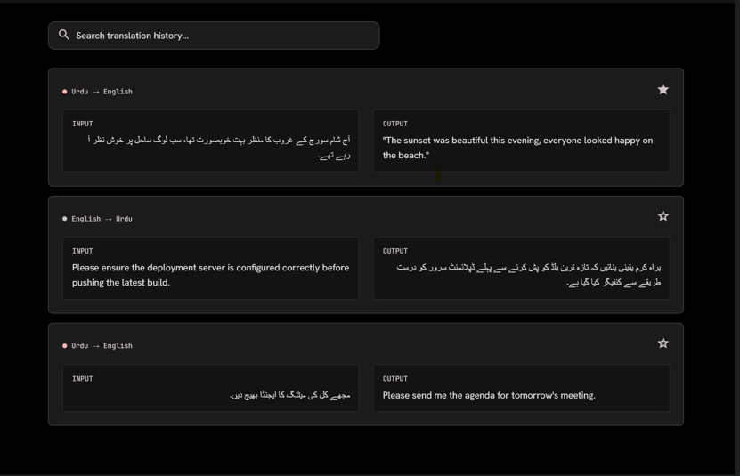

# English ↔ Urdu Translator

A context-aware chat application for translating between English and Urdu using Google Gemini - providing powerful AI-context-aware translation with robust fault tolerance.

---

## App Showcase

### Main Interface


### Translation Example


### Voice Input Feature


### Chat History Management


---

## Features

✅ **Context-Aware** - Maintains conversation history for better translation accuracy  
✅ **Google Gemini Powered** - Uses advanced AI capabilities  
✅ **Backup API Keys** - Automatically rotates through multiple keys to bypass rate limits  
✅ **Offline Fallback** - Switches to local MarianMT models if API keys are unavailable or exhausted  
✅ **Bidirectional Translation** - Seamless English ↔ Urdu switching  
✅ **Modern UI** - Built with Streamlit  

---

## Quick Start

### 1. Install Dependencies
```bash
pip install -r requirements.txt
